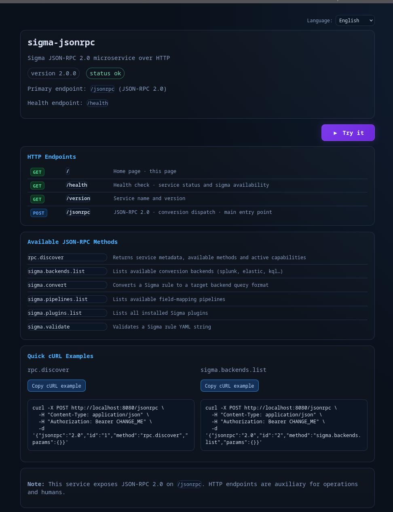
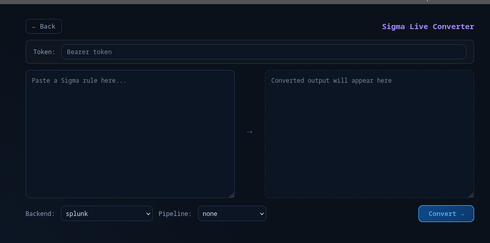

# sigma-jsonrpc

Professional HTTP microservice for Sigma with a primary **JSON-RPC 2.0** endpoint:

- `POST /jsonrpc`

It also exposes auxiliary HTTP endpoints for human use and operations:

- `GET /`
- `GET /health`
- `GET /version`

## Architecture

Implemented modular structure:

- `app/main.py`
- `app/config.py`
- `app/auth.py`
- `app/errors.py`
- `app/models.py`
- `app/engine.py`
- `app/rpc.py`
- `app/routes/http.py`
- `app/routes/jsonrpc.py`
- `app/templates/home.html`

## Available JSON-RPC Methods

- `rpc.discover`
- `sigma.backends.list`
- `sigma.pipelines.list`
- `sigma.plugins.list`
- `sigma.validate`
- `sigma.convert`

## Local Run

```bash
cd sigma-jsonrpc
python -m venv .venv
source .venv/bin/activate
pip install -r requirements.txt
cp .env.sample .env
uvicorn app.main:app --host 0.0.0.0 --port 8080
```

## Tests

```bash
cd sigma-jsonrpc
python -m venv .venv
source .venv/bin/activate
pip install -r requirements.txt
python -m unittest discover -s tests -p 'test_*.py'
```

## Docker Compose Run

```bash
cd sigma-jsonrpc
cp .env.sample .env
docker compose up --build
```

Service will be available at `http://localhost:8080/`.

## Authentication

`/jsonrpc` uses Bearer token authentication according to configuration:

- `SIGMA_AUTH_REQUIRED=true`
- `SIGMA_RPC_TOKEN=<token>`

If no `SIGMA_RPC_TOKEN` is defined in `.env` (or environment), the service allows requests without authentication.

Expected header:

```text
Authorization: Bearer <token>
```

Modes:

- Recommended secure mode:
  - `SIGMA_AUTH_REQUIRED=true`
  - `SIGMA_ALLOW_INSECURE_WITHOUT_TOKEN=false`
  - `SIGMA_RPC_TOKEN` must be set
- Insecure development mode:
  - `SIGMA_AUTH_REQUIRED=true`
  - `SIGMA_ALLOW_INSECURE_WITHOUT_TOKEN=true`
  - no token configured

## Allowlists

Allowed backends:

- `SIGMA_ALLOWED_BACKENDS=splunk,es-qs,eql,cortexxdr`

Allowed pipelines (optional):

- `SIGMA_ALLOWED_PIPELINES=windows,crowdstrike`

If `sigma.convert` receives a target or pipeline outside the allowlist, it returns a clear RPC error.

## Environment Variables

- `PORT` (default `8080`)
- `LOG_LEVEL` (default `INFO`)
- `SIGMA_BINARY` (default `sigma`)
- `SIGMA_COMMAND_TIMEOUT` (default `20`)
- `MAX_RULE_SIZE_BYTES` (default `131072`)
- `SIGMA_DISCOVERY_CACHE_TTL_SECONDS` (default `60`)
- `SIGMA_AUTH_REQUIRED` (default `true`)
- `SIGMA_ALLOW_INSECURE_WITHOUT_TOKEN` (default `true`)
- `SIGMA_RPC_TOKEN` (no default)
- `SIGMA_ALLOWED_BACKENDS` (default empty = no restriction)
- `SIGMA_ALLOWED_PIPELINES` (default empty = no restriction)

## HTTP Endpoints

The home page (`GET /`) is internationalized for:

- `en` (English)
- `es` (español)
- `fr` (français)
- `it` (italiano)
- `pt` (português)
- `de` (deutsch)
- `ru` (русский)

Language can be selected from the top combo box or forced with the query parameter:

- `/?lang=en`
- `/?lang=es`
- `/?lang=fr`
- `/?lang=it`
- `/?lang=pt`
- `/?lang=de`
- `/?lang=ru`

If the browser language is unsupported, the UI defaults to English (`en`).

## Interface Screenshots

Home page:



Live converter panel:



### `GET /health`

Response:

```json
{
  "status": "ok",
  "service": "sigma-jsonrpc",
  "version": "2.0.0",
  "sigma_available": true
}
```

### `GET /version`

Response:

```json
{
  "service": "sigma-jsonrpc",
  "version": "2.0.0"
}
```

## cURL Examples

### rpc.discover

```bash
curl -X POST http://localhost:8080/jsonrpc \
  -H "Content-Type: application/json" \
  -H "Authorization: Bearer CHANGE_ME" \
  -d '{"jsonrpc":"2.0","id":"1","method":"rpc.discover","params":{}}'
```

### sigma.backends.list

```bash
curl -X POST http://localhost:8080/jsonrpc \
  -H "Content-Type: application/json" \
  -H "Authorization: Bearer CHANGE_ME" \
  -d '{"jsonrpc":"2.0","id":"2","method":"sigma.backends.list","params":{}}'
```

### sigma.pipelines.list

List pipelines compatible with a specific backend:

```bash
curl -X POST http://localhost:8080/jsonrpc \
  -H "Content-Type: application/json" \
  -H "Authorization: Bearer CHANGE_ME" \
  -d '{"jsonrpc":"2.0","id":"2b","method":"sigma.pipelines.list","params":{"target":"splunk"}}'
```

### sigma.convert

```bash
curl -X POST http://localhost:8080/jsonrpc \
  -H "Content-Type: application/json" \
  -H "Authorization: Bearer CHANGE_ME" \
  -d '{"jsonrpc":"2.0","id":"3","method":"sigma.convert","params":{"target":"splunk","pipeline":"splunk_windows","rule":"title: Test Rule\nlogsource:\n  category: process_creation\ndetection:\n  selection:\n    Image|endswith: '\''\\\\cmd.exe'\''\n  condition: selection"}}'
```

If your backend supports it and you want to force conversion without a pipeline:

```bash
curl -X POST http://localhost:8080/jsonrpc \
  -H "Content-Type: application/json" \
  -H "Authorization: Bearer CHANGE_ME" \
  -d '{"jsonrpc":"2.0","id":"3b","method":"sigma.convert","params":{"target":"splunk","without_pipeline":true,"rule":"title: Test Rule\nlogsource:\n  category: process_creation\ndetection:\n  selection:\n    Image|endswith: '\''\\\\cmd.exe'\''\n  condition: selection"}}'
```

### sigma.validate

```bash
curl -X POST http://localhost:8080/jsonrpc \
  -H "Content-Type: application/json" \
  -H "Authorization: Bearer CHANGE_ME" \
  -d '{"jsonrpc":"2.0","id":"4","method":"sigma.validate","params":{"rule":"title: Test Rule\nlogsource:\n  category: process_creation\ndetection:\n  selection:\n    Image|endswith: '\''\\\\cmd.exe'\''\n  condition: selection"}}'
```

## Implementation Notes

- Engine logic is encapsulated in `SigmaEngine` (subprocess + sigma-cli).
- External calls use configurable timeout values.
- No `shell=True` usage.
- Inputs (`target`/`pipeline`/`format`) are validated using allowlists and a safe regex.
- Plugin discovery includes robust table parsing and in-memory TTL caching.
- If `sigma-cli` capabilities vary by version, the service keeps a stable RPC contract and returns clear engine errors.

## SPUC Default Remote Discovery

By default, SPUC now tries to reach a Sigma JSON-RPC service at:

- `http://localhost:8080/jsonrpc`

This fallback is used when `SIGMA_RPC_URL` is not set and is intentionally probed with a short timeout.

## Podman Troubleshooting

If `podman-compose up` fails with errors such as:

- `name "pod_sigma-jsonrpc" is in use`
- `container name ... is already in use`

clean stale resources and start again:

```bash
cd sigma-jsonrpc
podman-compose down
podman pod rm -f pod_sigma-jsonrpc || true
podman rm -f sigma-jsonrpc || true
podman-compose up --build
```

Notes:

- This compose file no longer pins `container_name`, which reduces name collisions.
- The service command explicitly binds Uvicorn to port `8080`.

## License

This project is licensed under the GNU Affero General Public License v3.0 (AGPL-3.0).
See the full license text in [COPYING](COPYING).
